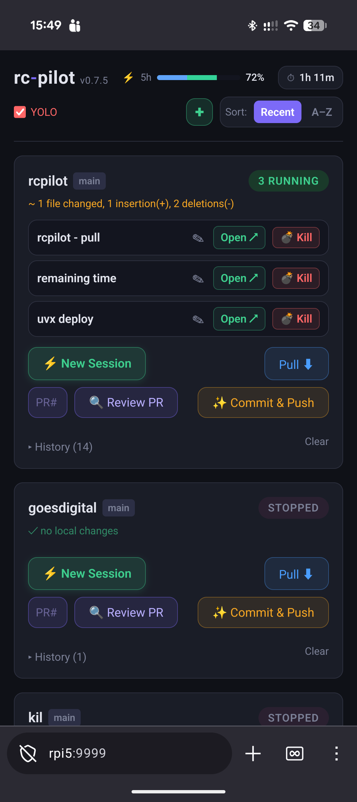

# rcpilot

> **Claude Code RC is powerful but ephemeral. rcpilot gives it a home.**

Self-hosted session manager for [Claude Code Remote Control](https://docs.anthropic.com/en/docs/claude-code).
Run it on a Raspberry Pi (or any always-on machine) and get a mobile-friendly web UI to launch,
reconnect to, and manage your coding sessions from anywhere.



---

## Features

- **Session management** — launch, reconnect, kill, and name RC sessions per project; full history with terminal snapshots
- **Git integration** — branch status, diff viewer, pull, and Claude-powered commit & push (auto-generates the commit message)
- **PR review** — trigger a Claude code review on any open GitHub PR; results posted as a PR comment
- **Usage tracking** — built-in Anthropic API proxy shows live 5h window utilization in the header
- **Schedulers** — cron-based usage-window warmer and Claude CLI auto-updater, both configurable
- **Project import** — clone a GitHub repo directly from the UI
- **YOLO mode** — global toggle for `--dangerously-skip-permissions`
- **Watchdog** — marks crashed or timed-out sessions automatically
- **Restart-safe** — sessions survive rcpilot restarts and Pi reboots

Mobile-first UI, works great on iOS Safari and Android Chrome. No app install needed.

---

## Quick start

```bash
uvx rcpilot          # one-shot, no install
```

Or install permanently and run as a systemd service:

```bash
uv tool install rcpilot

curl -o ~/.config/systemd/user/rcpilot.service \
  https://raw.githubusercontent.com/kjozsa/rcpilot/main/rcpilot.service
systemctl --user enable --now rcpilot
```

Open **http://localhost:8000** (or your Pi's IP/Tailscale hostname on port 8000).

---

## Configuration

Config is auto-created at `~/.config/rcpilot/config.toml` on first run. All fields are optional.

```toml
projects_dir = "~/projects"   # each subdirectory becomes a project
host = "0.0.0.0"
port = 8000
db_path = "~/.config/rcpilot/pilot.db"

# Cron to fire "claude -p hi" and start the 5h rolling usage window
window_cron = "0 7,12,17 * * *"

# Cron to run "claude update" (set to "" to disable)
claude_update_cron = "0 6,18 * * *"
```

Supported cron syntax: `*`, `*/n`, `a-b`, `a,b,c` (5-field, local time).

---

## Requirements

- Python 3.11+
- `claude` — Claude Code CLI, on `PATH` and authenticated
- `gh` — GitHub CLI, only needed for PR review

---

## Security note

No authentication. Run on a trusted private network only (Tailscale, WireGuard, or local LAN).
**Do not expose port 8000 to the public internet.**

---

## Roadmap

| Phase | Status | Focus |
|-------|--------|-------|
| 0 — Foundation | ✅ done | Project discovery, web UI, session spawning |
| 1 — Persistence | ✅ done | Session history, snapshots, watchdog, git & PR integration |
| 1.5 — Tooling | ✅ done | Usage proxy, Claude auto-updater, project import, Claude-powered commit |
| 2 — Context memory | 🔜 next | Claude API summarization, resume with injected context |
| 3 — Polish | 💡 planned | Auth, PWA, PyPI publish, Docker, CI |

See [ROADMAP.md](ROADMAP.md) for details.

---

## Development

```bash
uv sync --extra dev
uv run pytest
uv run rcpilot
```

---

MIT License
