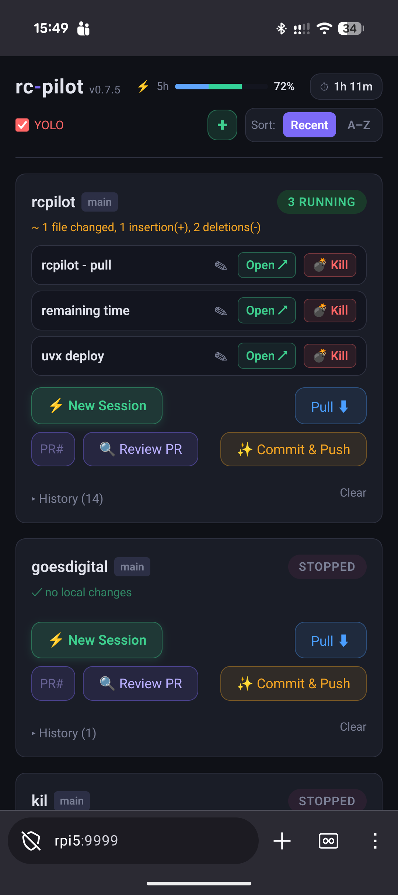
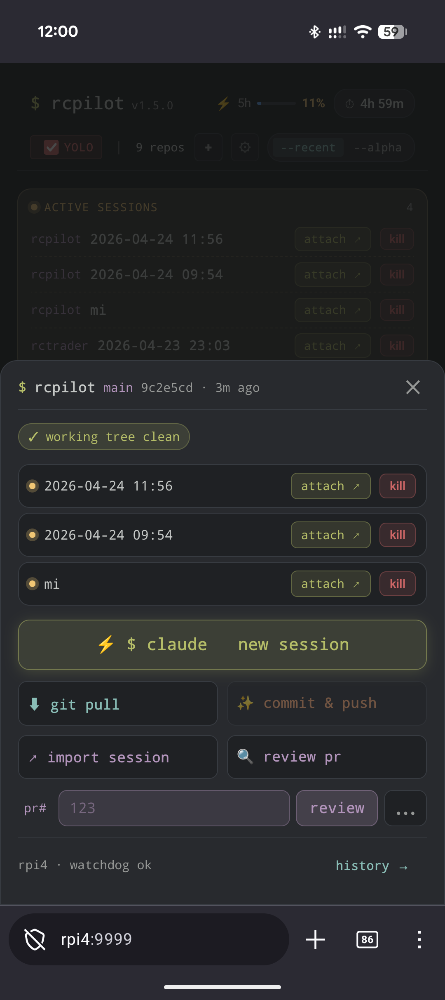

> **Claude Code RC is powerful but ephemeral. rcpilot gives it a home.**

Self-hosted session manager for [Claude Code Remote Control](https://docs.anthropic.com/en/docs/claude-code).
Run it on a Raspberry Pi (or any always-on machine) and get a mobile-friendly web UI to launch,
reconnect to, and manage your coding sessions from anywhere.

 

---

## Features

- **Session management** — launch, reconnect, kill, and name RC sessions per project; full history with terminal snapshots
- **Multiple machines** — manage projects and sessions on other hosts over ssh from the same UI
- **Git integration** — branch status, diff viewer, pull, and Claude-powered commit & push (auto-generates the commit message)
- **PR review** — trigger a Claude code review on any open GitHub PR; results posted as a PR comment
- **Usage tracking** — built-in Anthropic API proxy shows live 5h window utilization in the header
- **Schedulers** — cron-based usage-window warmer and Claude CLI auto-updater, both configurable
- **Self-update** — checks PyPI every 6 hours; shows a banner when a new version is available (or upgrades silently in auto mode)
- **Project import** — clone a GitHub repo directly from the UI
- **YOLO mode** — global toggle for `--dangerously-skip-permissions`
- **Watchdog** — marks crashed or timed-out sessions automatically
- **Restart-safe** — sessions survive rcpilot restarts and Pi reboots

Mobile-first UI, works great on iOS Safari and Android Chrome. Install as a PWA from Android Chrome for a native app feel — rcpilot will prompt you automatically on first visit.

---

## Quick start

```bash
uvx rcpilot          # one-shot, no install
```

Or install permanently and run as a systemd service:

```bash
uv tool install rcpilot

curl -o ~/.config/systemd/user/rcpilot.service \
  https://raw.githubusercontent.com/kjozsa/rcpilot/main/rcpilot.service
systemctl --user enable --now rcpilot
```

Open **http://localhost:8000** (or your Pi's IP/Tailscale hostname on the configured port).

---

## Configuration

Config is auto-created at `~/.config/rcpilot/config.toml` on first run. All fields are optional.

```toml
projects_dir = "~/projects"   # each subdirectory becomes a project
host = "0.0.0.0"
port = 8000
db_path = "~/.config/rcpilot/pilot.db"

# Cron to fire "claude -p hi" and start the 5h rolling usage window
window_cron = "0 7,12,17 * * *"

# Cron to run "claude update" (set to "" to disable)
claude_update_cron = "0 6,18 * * *"

# Self-update mode: "prompt" shows a banner; "auto" upgrades and restarts silently
rcpilot_update_mode = "prompt"
```

Supported cron syntax: `*`, `*/n`, `a-b`, `a,b,c` (5-field, local time).

---

## Multiple machines

rcpilot can manage projects on other hosts over ssh — start a session on your
desktop from your phone, then pick it up at the desk later.

Add one from **Settings (⚙) → Remote hosts**: enter the hostname (`stardust`, or
`kjozsa@stardust`) and the directories to scan. rcpilot tests the ssh connection
before saving and refuses a host it cannot reach, so a typo tells you straight
away instead of showing up later as a permanently offline chip. Hosts apply
immediately — no restart.

**edit** loads a host back into the form to change its hostname or directories;
adding the same host twice is rejected rather than merged, so a directory you
meant to drop cannot survive by accident.

Or write the config by hand, one `[[hosts]]` block per machine:

```toml
[[hosts]]
name = "stardust"            # label in the UI; also prefixes project keys
ssh = "kjozsa@stardust"      # anything ssh accepts, incl. ~/.ssh/config aliases
projects_dir = "~/projects"  # path on that machine
```

Their repos join the project list with a host chip next to the name; everything
else — new session, kill, git pull, commit & push, PR review, history — runs on
whichever machine owns the project. Sessions launch inside a transient
`systemd-run --user` unit, so they survive the ssh connection closing, an
rcpilot restart, and a reboot of the box rcpilot runs on.

`projects_dir` takes a single path or a list. Preparation on each remote host:

```bash
ssh-copy-id kjozsa@stardust      # from the rcpilot machine — must be passwordless
ssh stardust loginctl enable-linger $USER   # keep the user manager alive after logout
```

`claude` must be on the login-shell PATH there and already authenticated
(`claude` once, interactively). Projects are keyed as `stardust:myrepo`
internally; local ones keep their bare names, so existing history is unaffected.

Two caveats worth knowing:

- The usage widget only tracks this machine. Remote `claude -p` calls (commit
  messages, PR reviews) talk to Anthropic directly rather than through rcpilot's
  proxy, so their tokens don't appear in the 5h window.
- The claude auto-updater updates the local CLI only, and restarts local
  sessions only. Remote hosts update on their own schedule.

If a host is unreachable, its chip in the header says so and its projects drop
out of the list — local projects and any other host stay fully usable. Running
sessions on an unreachable host are **never** marked stopped; a network blip
must not garbage-collect live work.

---

## Requirements

- Python 3.11+
- `claude` — Claude Code CLI, on `PATH` and authenticated
- `gh` — GitHub CLI, only needed for PR review
- `ssh` with key-based auth, only needed for remote hosts

---

## Security

By default rcpilot has **no authentication** — designed for a private trusted network. If visitors use your local network, enable a keyphrase and HTTPS.

### Keyphrase auth

Add to `~/.config/rcpilot/config.toml` and restart:

```toml
admin_keyphrase = "your-secret-here"
```

The UI shows a login screen. Sessions last 7 days per browser.

### HTTPS with mkcert

Without HTTPS the keyphrase is visible in plaintext on the network. [mkcert](https://github.com/FiloSottile/mkcert) creates a locally-trusted certificate with no browser warnings.

```bash
# Install mkcert
sudo apt install mkcert        # Debian/Raspberry Pi OS
# brew install mkcert          # macOS

# Create local CA (once — also run on each browser/device that needs to trust it)
mkcert -install

# Generate certificate
mkdir -p ~/.config/rcpilot/tls
mkcert -key-file ~/.config/rcpilot/tls/key.pem \
       -cert-file ~/.config/rcpilot/tls/cert.pem \
       localhost raspberrypi.local 192.168.1.x
```

Add to config and restart:

```toml
ssl_certfile = "~/.config/rcpilot/tls/cert.pem"
ssl_keyfile  = "~/.config/rcpilot/tls/key.pem"
```

Then open **https://** instead of http://. For mobile devices, copy `~/.local/share/mkcert/rootCA.pem` from the Pi to the device and install it as a trusted certificate.

**Do not expose rcpilot to the public internet.**

---

MIT License
